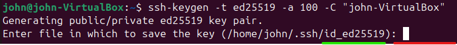

*On doit avoir dans cette documentation (pour la tâche principale et secondaire) :*
- *Prérequis techniques*
- *Installation/Mise en place de la solution (explication étape par étape, ligne de code, copie d’écran, etc.) sur le client et/ou le serveur*
  - Installation OPENSSH
- *FAQ*
____

# Installation OPENSSH
**1** -  Lancer la commande suivante pour installer <u>OpenSSH</u> sur le serveur

``` bash
sudo apt install openssh-server -y
```

**2** -  Activer le SSH immédiatement ainsi qu'au démarrage

``` bash
sudo systemctl enable ssh --now
```

**3** -  Vérifier le statut du SSH

``` bash
sudo systemctl status ssh --no-pager
```

**4** - Lecture du Statut : *Active running* (ou *enabled*) en <font color="#00b050">vert</font> indique que le daemon OpenSSH est bien actif dans le système


**Optionnel 1** - Si un pare-feu UFW est utilisé, entrer cette Commande pour autoriser SSH

``` bash
sudo ufw allow OpenSSH
```

**Optionnel 2** - Test côté Serveur s'il écoute sur le *port 22*

``` bash
ss -tnlp | grep :22
```

# Création d'une clé SSH

**1** - Entrer la commande suivante puis choisir le dossier de destination de la clé (en rouge le <font color="#ff0000">champ d'écriture</font> / en vert le <font color="#00b050">chemin par défaut</font> si aucune donnée n'est entrée)

``` bash
ssh-keygen -t ed25519 -a 100 -C "NomDuPosteClient"
```



**2** - Choisir le **PassPhrase** qui viendra protéger la clé SSH

**3** - Entrer à nouveau le **PassPhrase** pour valider la création de la clé SSH

**4** - Copiez automatiquement votre clé publique vers le serveur avec ssh-copy-id

``` bash
ssh-copy-id -i ~/.ssh/id_ed25519.pub utilisateur@ip_ou_domaine
```
