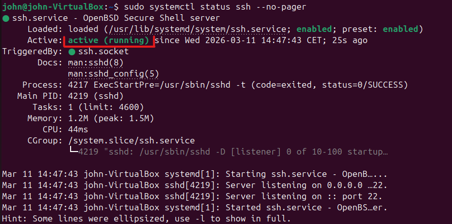

- *Prérequis techniques* :
  
- *Installation/Mise en place de la solution (explication étape par étape, ligne de code, copie d’écran, etc.) sur le client et/ou le serveur*
  - Installation Putty
  - Installation OPENSSH
  - Installation de TightVNC client et Serveur
  - Installation RDP
 
- *FAQ* :
  - Putty
  - OpenSSH
  - TightVNC Client / Serveur
  - RDP 
____

## Installation PuTTY

**Prérequis techniques :**
- Système d'exploitation Windows 64 bits
- *Une version pour système 32 bits est à disposition sur le site internet*

Vous pouvez télécharger la dernière version de PuTTY directement depuis le [Miscrosoft Store](https://apps.microsoft.com/detail/xpfnzksklbp7rj?hl=fr-FR&gl=FR) ou télécharger l'installeur depuis [le site officiel de Putty](https://putty.org/index.html)

____

Si vous utilisez Microsoft Store vous pouvez suivre l'installation à partir de l'étape 3, sinon voici la procédure :

**1** -  Sur la page d'accueil cliquer sur "Download PuTTY"


**2** -  Dans la rubrique "Package Files" cliquer sur le premier lien "putty-64bit-0.83-installer.msi" afin de télécharger l'installeur 


**3** -  Lancer l'installation en double-cliquant sur le fichier téléchargé, cliquer sur "Next" sur la première page


**4** -  Sélectionner le chemin d'installation du logiciel (Ne modifier qu'en cas d'installation particulière)


**5** -  Pour ajouter un raccourci sur le bureau, dans la page "Product Features" cliquer sur le second titre "Add shortcut to PuTTY on the desktop" et sélectionner "Will be installed on local hard drive"


**6** -  Cliquer sur "Yes" afin d'accepter l'installation du logiciel


**7** -  Cliquer sur "Finish" afin de terminer l'installation, penser à décocher "view Readme File" pour ne pas déclencher l'ouverture du manuel d'utilisation - si non souhaité


### FAQ - PuTTY

**Qu'est-ce que PuTTY et à quoi ça sert ?**

PuTTY est un client SSH permettant d'exécuter des sessions terminal à distance via le réseau, et supporte aussi les connexions série et d'anciens protocoles comme Telnet

**Où télécharger PuTTY en toute sécurité ?** 

Le vrai site officiel est celui indiqué est [chiark.greenend.org](https://www.chiark.greenend.org.uk/~sgtatham/putty/)
Vous pouvez également retrouver la dernière version officiel de PuTTY sur le [Microsoft Store](https://apps.microsoft.com/detail/xpfnzksklbp7rj?hl=fr-FR&gl=US)

**Quelle version d'installeur choisir : 32-bit ou 64-bit ?**  

Il faut vérifier votre configuration en tapant "system information" dans la recherche Windows et regarder le champ "System Type" : x64 = 64-bit x86, ARM64 = 64-bit Arm, x32 = 32-bit.

La version la plus fréquente étant : 64-bit x86.

**Ou sont sauvegardées les données de sessions de PuTTY ?**

Sous Windows, PuTTY stocke la plupart de ses données (sessions sauvegardées, clés hôtes SSH) dans le Registre. L'emplacement précis est

```
HKEY_CURRENT_USER\Software\SimonTatham\PuTTY
```

et dans cette zone, les sessions sauvegardées sont stockées sous `Sessions`pendant que les clés hôtes sont stockées sous `SshHostKeys`.

____

## Installation OPENSSH

**Prérequis techniques :**
  - Bénéficier des droits Administrateur

**1** -  Lancer la commande suivante pour installer <u>OpenSSH</u> sur le serveur

``` bash
sudo apt install openssh-server -y
```

**2** -  Activer le SSH immédiatement ainsi qu'au démarrage

``` bash
sudo systemctl enable ssh --now
```

**3** -  Vérifier le statut du SSH

``` bash
sudo systemctl status ssh --no-pager
```

**4** - Lecture du Statut : *Active running* (ou *enabled*) en <font color="#00b050">vert</font> indique que le daemon OpenSSH est bien actif dans le système



**Optionnel 1** - Si un pare-feu UFW est utilisé, entrer cette Commande pour autoriser SSH

``` bash
sudo ufw allow OpenSSH
```

**Optionnel 2** - Test côté Serveur s'il écoute sur le *port 22*

``` bash
ss -tnlp | grep :22
```
## FAQ - OpenSSH

**Qu'est-ce que OpenSSH et à quoi ça sert ?**

_SSH_ (Secure Shell) = un protocole de connexion qui impose un échange de clés de chiffrement en début de connexion.
Il chiffre tout le trafic entre le client et le serveur pour éliminer les écoutes clandestines, le détournement de connexion et d’autres attaques.
OpenSSH offre une large suite de capacités de tunneling sécurisé, plusieurs méthodes d’authentification et des options de configuration sophistiquées.

**Où télécharger OpenSSH en toute sécurité ?**

Pour cela suivre le tutoriel d'installation, l'installation par cmd est sécurisée

**Comment mettre à jour OpenSSH**

Entrer la ligne de commande suivante dans le terminal :
``` bash
sudo apt update && sudo apt upgrade
```

____


## Installation TightVNC


| Prérequis technique pour windows server 2025                                                                                                                                                                                                                                                                                                                                                                                                                                             | Prérequis technique minimum pour Ubuntu LTS 24.04                                                                                                                                                                                                                                                                                                                                                                                         |
| ---------------------------------------------------------------------------------------------------------------------------------------------------------------------------------------------------------------------------------------------------------------------------------------------------------------------------------------------------------------------------------------------------------------------------------------------------------------------------------------- | ----------------------------------------------------------------------------------------------------------------------------------------------------------------------------------------------------------------------------------------------------------------------------------------------------------------------------------------------------------------------------------------------------------------------------------------- |
| **CPU Minimum**:<br>    - Processeur 1,4 GHz 64 bits<br>    - Compatible avec le jeu d’instructions x64<br><br>**RAM Minimum :**<br>    - 2 Go pour Server Core<br>    - 2 Go pour Serveur avec interface de bureau, 4 Go recommandés<br><br>**Stockage Minimum :**<br>    - 32 Go d’espace<br><br>**Réseau Minimum :** <br>    - Adaptateur Ethernet pouvant atteindre un débit d’au moins 1 gigaoctet par seconde.<br>    - Conforme à la spécification de l’architecture PCI Express. | **CPU Minimum :**<br>	 - Processeur 2 GHz double cœur ou plus ;<br><br> **RAM Minimum :** <br>	- 4 Go de mémoire vive (8 Go recommandés) ;<br><br>**Stockage minimum :**<br>	 - 25 Go d'espace disque disponible<br>	 <br> **Carte graphique :**<br>    - Carte graphique compatible avec une résolution 1024×768 minimum ;<br>	<br>**Connectique :**<br>	- Clé USB de 8 Go pour l'installation.<br>    - Une souris (ou touchpad sur PC) |

____

## Installation de TightVNC JavaViewer sur Ubuntu

**1**. Vérifier que nous avons java via le terminal

```bash
java -version
```

**2**. Installation de Java s'il n'est pas présent 

```bash 
sudo apt install openjdk-25-jre
```

**3**. Vérification de la présence de Java à nouveau

```bash
java -version
```

**4**. Je me rend sur le site de TightVNC pour télécharger le client VNC suivant : TightVNC Java Viewer


**5**. Une fois téléchargé, je vais dans le dossier Téléchargement pour vérifier que le fichier Zip est bien présent puis je le décompresse via le terminal

```bash
cd ~/Téléchargements
```
```bash
ls
```
```bash
unzip "NomDuFichierZip"
```

**6**. Le logiciel est installé et prêt à l'emploi


____


## Installation de TightVNC server sur Windows server 2025

**1**. Aller sur le site de TightVNC et télécharger l'application : Installer for windows -64bits

![[Pasted image 20260316120706.png]](https://raw.githubusercontent.com/WildCodeSchool/TSSR-0226-P1-G2/6607b2922d092a8b9d6db3af30fcd7e9fba8dccb/Ressources/Install%20TightVNC%20windows%20server%202025%201.png)

**2**. Lancer l'exécutable et commencer l'installation de TightVNC server

![[Pasted image 20260316120750.png]](https://raw.githubusercontent.com/WildCodeSchool/TSSR-0226-P1-G2/6607b2922d092a8b9d6db3af30fcd7e9fba8dccb/Ressources/Install%20TightVNC%20windows%20server%202025%202.png)

**3**. Accepter les thermes de la license *

![[Pasted image 20260316120822.png]](https://raw.githubusercontent.com/WildCodeSchool/TSSR-0226-P1-G2/6607b2922d092a8b9d6db3af30fcd7e9fba8dccb/Ressources/Install%20TightVNC%20windows%20server%202025%203.png)

**4**. Choisir le setup "custom" et ne sélectionner que TightVNC server

![[Pasted image 20260316120851.png]](https://raw.githubusercontent.com/WildCodeSchool/TSSR-0226-P1-G2/6607b2922d092a8b9d6db3af30fcd7e9fba8dccb/Ressources/Install%20TightVNC%20windows%20server%202025%204.png)
![[Pasted image 20260316120925.png]](https://raw.githubusercontent.com/WildCodeSchool/TSSR-0226-P1-G2/6607b2922d092a8b9d6db3af30fcd7e9fba8dccb/Ressources/Install%20TightVNC%20windows%20server%202025%205.png)

**5**. Prêt a être installé et on lance l'installation

![[Pasted image 20260316121015.png]](https://raw.githubusercontent.com/WildCodeSchool/TSSR-0226-P1-G2/6607b2922d092a8b9d6db3af30fcd7e9fba8dccb/Ressources/Install%20TightVNC%20windows%20server%202025%206.png)

**6**. Définir un mot de passe pour sécuriser et lancer l'autorisation de contrôle à distance

![[Pasted image 20260316121106.png]](https://raw.githubusercontent.com/WildCodeSchool/TSSR-0226-P1-G2/6607b2922d092a8b9d6db3af30fcd7e9fba8dccb/Ressources/Install%20TightVNC%20windows%20server%202025%207.png)

**7**. L'installation est complète 

![[Pasted image 20260316121153.png]](https://raw.githubusercontent.com/WildCodeSchool/TSSR-0226-P1-G2/6607b2922d092a8b9d6db3af30fcd7e9fba8dccb/Ressources/Install%20TightVNC%20windows%20server%202025%208.png)

**8**. Vérification du lancement du serveur avec demande d'authentification

![[Pasted image 20260316121234.png]](https://raw.githubusercontent.com/WildCodeSchool/TSSR-0226-P1-G2/6607b2922d092a8b9d6db3af30fcd7e9fba8dccb/Ressources/Install%20TightVNC%20windows%20server%202025%209.png)


## FAQ - TightVNC

### Quelles versions de Windows TightVNC supporte-t-il ?

TightVNC fonctionne quasiment sur n’importe quelle version de Windows (les systèmes 32 et 64 bits sont pris en charge) :

- Windows XP / Vista / 7 / 8 / 8.1 / 10 / 11,
- versions correspondantes de Windows Server.
Sur Windows XP, vous devriez avoir le dernier Service Pack installé. Les systèmes Windows CE ne le sont pas soutenu.
## Quelle est la Configuration requise pour utiliser TightVNC

Il n’y a pas d’espace disque, ni de RAM minimum . TightVNC utilise si peu d’espace et de mémoire qu’il peut tourner partout où Windows fonctionne.
## Comment désinstaller TightVNC ?

Normalement, TightVNC peut être retiré comme n’importe quel autre logiciel, depuis le panneau de configuration (Ajouter/Supprimer des programmes). Mais si quelque chose tourne mal, ou si TightVNC a été installé manuellement, vous Vous pouvez toujours le retirer manuellement en utilisant les procédures étape par étape ci-dessous : 
1. Connectez-vous en tant qu’administrateur (ou en tant qu’utilisateur avec des permissions similaires).
2. Si le serveur TightVNC tourne, fermez-le. Si l’icône du plateau tourne mais ne s’affiche pas, Choisissez Gestion des processus, localisez tous les processus tvnserver.exe et fermez chacun d’eux.
3. Si TightVNC Server était enregistré comme service système, désenregistrez-le. Pour cela, localisez tvnserver.exe fichier sous \Program Files\TightVNC (ou là où TightVNC était installé), et Tapez dans la ligne de commande : tvnserver.exe -remove
4. Supprimez tout le dossier \Program Files\TightVNC (ou là où se trouvait TightVNC).
5. Supprimez tous les raccourcis TightVNC du menu Démarrer.
6. Supprimez les paramètres du registre si vous le souhaitez. Les réglages se trouvent dans HKEY_LOCAL_MACHINE\Logiciel\TightVNC et/ou HKEY_CURRENT_USER\Logiciel\TightVNC


____


## Installation RDP

**Prérequis techniques :**
		- RDP est intégré sur Windows 11 et Windows Server 2022-2025

____

**1** - Accéder au client RDP : 
		- Depuis le clavier, appuyez sur les touches Win + R
		- Saisissez **mstsc** ou bien, dans le menu démarrer, recherchez « **Connexion Bureau à Distance** »


|  |  |
| ------------------------------------------------------------------------------------------------------ | ----------------------------------------------------------------------------------------------------------------- |


**2** - Utilisation :
		- Saisissez l’adresse IP ou le nom de la machine distante
		- Cliquez sur connexions
		- Saisissez les identifiants utilisateur (nom utilisateur & mot de passe)
		- Cliquez sur Ok pour établir la connexion


**3** - Configuration du PC pour Accepter les Connexions RDP 
Pour recevoir les connexions RDP sur son ordinateur. Il faut activer le Bureau à Distance :
		- Accédez aux paramètres Windows en appuyant sur les touches **Win + I**.
	    - Allez dans **Système** puis **Bureau à distance**.
	    - Activez l’option **Bureau à distance**.

## FAQ - RDP

**Qu'est-ce que RDP et à quoi ça sert ?**

**RDP** est un outil logiciel qui vous permet de se connecter à un autre ordinateur et de le contrôler via l’internet ou un réseau interne.  
Le client **RDP** est disponible sur la version Bureau et serveur de **Windows**.
